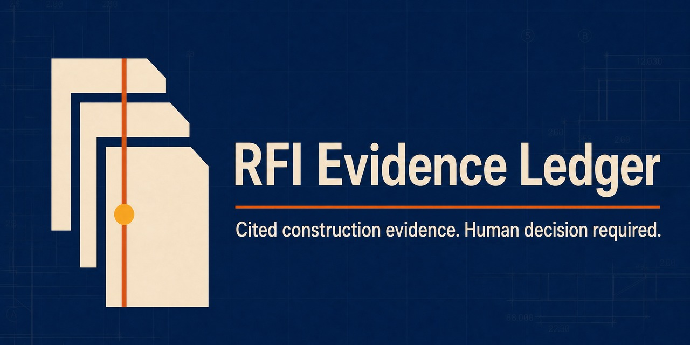

#  RFI Evidence Ledger

> **Cited construction evidence. Human decision required.**

[](ALPHA_BOUNDARY.md)
[](EVALUATOR_CHECKLIST.md)
[](SECURITY_BOUNDARY.md)

> **Launch-site preview:** [Open the RFI Evidence Ledger evaluation-alpha website](https://rfievidledge-8i6jveid.manus.space). The site explains the public offline evaluation; it is not a live-project demo or a production service.

**RFI Evidence Ledger** is a bounded construction-document evidence-runner evaluation alpha. Given one approved task manifest and one local, versioned document bundle, it creates a source registry, identifies current and superseded revisions, checks the document-access boundary, and produces a cited evidence dossier or an explicit safe-stop outcome.

It is intentionally **not** an autonomous construction agent. It cannot submit an RFI, modify a project record, access the web, connect to Procore/SharePoint/Drive, send email, calculate schedule or cost impact, make an engineering determination, or replace a project manager’s decision.



## What the alpha proves

The included offline fixture provides a small, repeatable evaluator harness. It proves that the local runner can create reviewable artifacts for five controlled outcomes:

| Scenario | Expected terminal state | What it demonstrates |
|---|---|---|
| Current drawing and specification evidence | `evidence_packet_ready` | Current-source citations can be replayed against a local source registry. |
| Superseded drawing revision | `stale_revision_detected` | A prior revision is not treated as governing evidence. |
| Contradictory current sources | `conflicting_evidence` | The runner escalates instead of resolving a construction conflict. |
| Missing expected source | `missing_source` | Incomplete evidence stops the workflow. |
| Unauthorized document in the bundle | `policy_blocked` | The manifest boundary is enforced before evidence generation. |

The fixture is deterministic and contains **no model call, API key, browser, network access, PDF/CAD parser, live integration, or customer project data**. It demonstrates the evidence-control layer, not real-project accuracy.

## Run the full evaluation in one command

```bash
git clone <your-fork-or-local-copy>
cd rfi-evidence-ledger-alpha
python3 -m pip install -e ".[dev]"
python3 scripts/verify_evaluation_alpha.py
```

Expected result:

```text
evaluation_cases=5 passed=5 failed=0
```

The evaluation writes a factual matrix, one Markdown dossier, and one JSON receipt for each scenario to `artifacts/evaluation_alpha/`.

## Run one manifest

```bash
python3 -m rfi_evidence_ledger.cli \
  --task examples/supported_evidence.json \
  --output artifacts/manual_run
```

The CLI prints the terminal state and local paths for the resulting dossier and receipt.

## Why the runner stops instead of guessing

| Control | How this alpha implements it |
|---|---|
| **Explicit task contract** | Every run begins with strict JSON intake naming the RFI, bundle, allowed sources, required sources, scenario, and budgets. |
| **Read-only source boundary** | The policy checks document keys before the runner inspects the fixture bundle. |
| **Revision registry** | Document keys, revisions, and current/superseded state are deterministic fixture metadata. |
| **Claim-level citations** | Every emitted claim contains a document ID, revision, page/sheet, region label, and source text. |
| **Independent replay check** | A separate verifier replays citation identity and confirms that it points to a current approved source. |
| **Safe-stop vocabulary** | The runner reports stale, conflicting, missing, blocked, intake-rejected, or verification-failed states rather than inventing a conclusion. |
| **Human decision receipt** | Every artifact says that a human project manager must decide whether to issue any official response. |

## Repository map

| Path | Purpose |
|---|---|
| [`ALPHA_BOUNDARY.md`](ALPHA_BOUNDARY.md) | Exact evaluation-alpha claims and exclusions. |
| [`EVALUATOR_CHECKLIST.md`](EVALUATOR_CHECKLIST.md) | A short, independent evaluation procedure. |
| [`SECURITY_BOUNDARY.md`](SECURITY_BOUNDARY.md) | Threat model and non-negotiable no-action boundary. |
| [`docs/ARCHITECTURE.md`](docs/ARCHITECTURE.md) | Architecture and future pilot path. |
| [`examples/`](examples/) | Strict task manifests for the five controlled cases. |
| [`fixtures/project_alpha/`](fixtures/project_alpha/) | Transparent local versioned-document fixture. |
| [`artifacts/evaluation_alpha/`](artifacts/evaluation_alpha/) | Generated evidence dossiers, receipts, and evaluation matrix. |
| [`RELEASE_NOTES_v0.1.0-alpha.md`](RELEASE_NOTES_v0.1.0-alpha.md) | Truth-aligned launch notes. |

## Evaluation boundary

This repository is an **evaluation alpha**, not production software. It has no paid users, no customer validation, no authenticated integrations, no guaranteed accuracy, no demonstrated return on investment, and no authority to take an external project action. Please read [ALPHA_BOUNDARY.md](ALPHA_BOUNDARY.md) before evaluating or sharing it.

## Feedback and pilot interest

Technical evaluators can use the repository’s issue templates to report a reproducible boundary concern, a documentation gap, or interest in a **document-only historical evaluation**. Do not post customer drawings, specifications, RFI contents, credentials, project links, contracts, personal data, or confidential material in public issues.

A future pilot must use a customer-approved historical document set, a named accountable human reviewer, and an explicit data-handling agreement before any external model, connector, or production source is involved.

## License

MIT. See [`LICENSE`](LICENSE).
