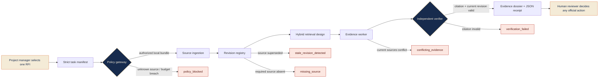

# Architecture

RFI Evidence Ledger is designed as an **evidence-control layer**. In the evaluation alpha, the source bundle is a transparent local JSON fixture rather than a real PDF/CAD parser or customer connector. The same bounded flow is intended for a future customer-controlled pilot.

## Alpha implementation versus future pilot design

| Layer | Evaluation alpha | Future customer-controlled pilot |
|---|---|---|
| Source intake | Transparent local JSON fixture. | Customer-approved drawings, specifications, addenda, submittals, and RFI records through a named bundle manifest. |
| Parsing | Fixture source regions include page/sheet labels and parser-confidence fields. | Layout-aware PDF/image/drawing parser that preserves title blocks, revision tables, source page/sheet, bounding regions, and parsing warnings. |
| Revision control | Declared document key/revision/status metadata. | Deterministic source registry backed by customer-approved document-control metadata. |
| Retrieval | Controlled scenario logic. | Revision-filtered metadata, exact lexical references, semantic retrieval, and coverage checks. |
| Evidence claims | Deterministic fixture claims. | Structured claim/citation proposals with no material claim accepted without validated evidence. |
| Verification | Replays citation existence and current revision. | Citation/source-span checks, current-revision validation, conflict/gap detection, policy checks, and optional isolated semantic support review. |
| Output | Markdown dossier and JSON receipt. | Same artifact types plus customer-approved retention, trace export, and human-decision receipt. |
| External actions | None. | Still none by default; any read-only or write integration would require a separate customer security and authorization design. |

## Non-negotiable properties

The source bundle is selected before a run; the policy engine—not a model—enforces which source classes may be read; evidence claims carry citations; citation validation is separate from evidence generation; and a human reviewer makes any project decision. The alpha’s explicit stop states are part of the product behavior, not error messages to ignore.
